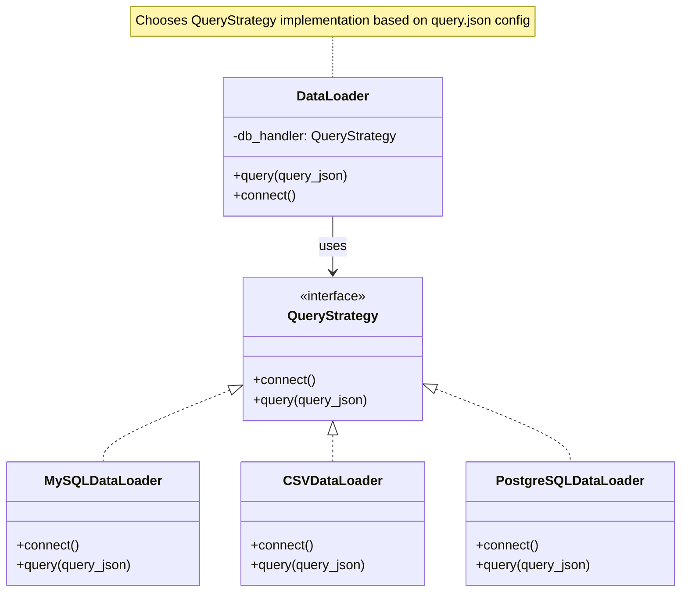

---

**Explanation:**

Yes, the Strategy design pattern is a perfect fit for this scenario. In this pattern, `DataLoader` acts as the context and delegates the database operations to a `QueryStrategy` interface. Concrete strategies like `MySQLDataLoader`, `CSVDataLoader`, and `PostgreSQLDataLoader` implement the `QueryStrategy` interface. At runtime, `DataLoader` selects the appropriate strategy based on the configuration in `query.json`, allowing flexible and extensible support for different data sources without changing the `DataLoader` logic.