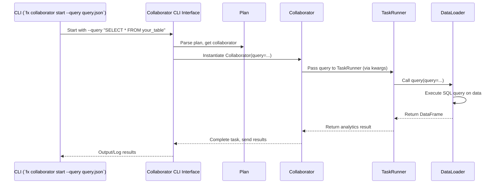

```mermaid
sequenceDiagram
    participant CLI as CLI (`fx collaborator start --query query.json`)
    participant Interface as Collaborator CLI Interface
    participant Plan as Plan
    participant Collaborator as Collaborator
    participant TaskRunner as TaskRunner
    participant DataLoader as DataLoader

    CLI->>Interface: Start with --query "SELECT * FROM your_table"
    Interface->>Plan: Parse plan, get collaborator
    Interface->>Collaborator: Instantiate Collaborator(query=...)
    Collaborator->>TaskRunner: Pass query to TaskRunner (via kwargs)
    TaskRunner->>DataLoader: Call query(query=...)
    DataLoader->>DataLoader: Execute SQL query on data
    DataLoader-->>TaskRunner: Return DataFrame
    TaskRunner-->>Collaborator: Return analytics result
    Collaborator-->>Interface: Complete task, send results
    Interface-->>CLI: Output/Log results
```